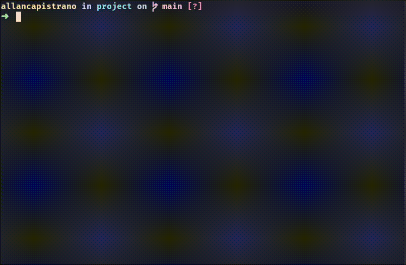

<h1 align="center">Git Better Commit</h1>

  

------------

## :book: Description ##
**Git Better Commit (gbc) is a command line interface written in Golang that provides a simple way to write commits following the [Conventional Commits](https://www.conventionalcommits.org/).**

------------

## :man_technologist: Author ##

|  |
| -----------------------------------------------------------------------------------------------------------|
| [Allan Capistrano](https://github.com/AllanCapistrano)                                                     |

    <h3>My socials:</h3>
    
    &nbsp
     
    &nbsp
    

------------

## :pray: Support ##

**Please :star: this repository if this project is useful or has helped you.**

------------

## :balance_scale: License ##
[GPL-3.0 License](./LICENSE)
